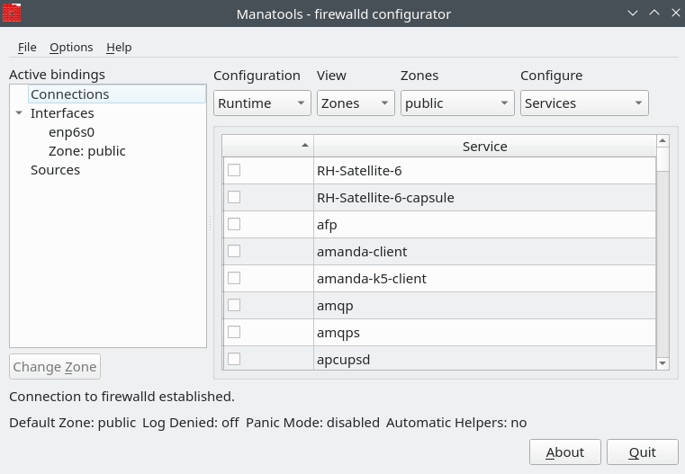
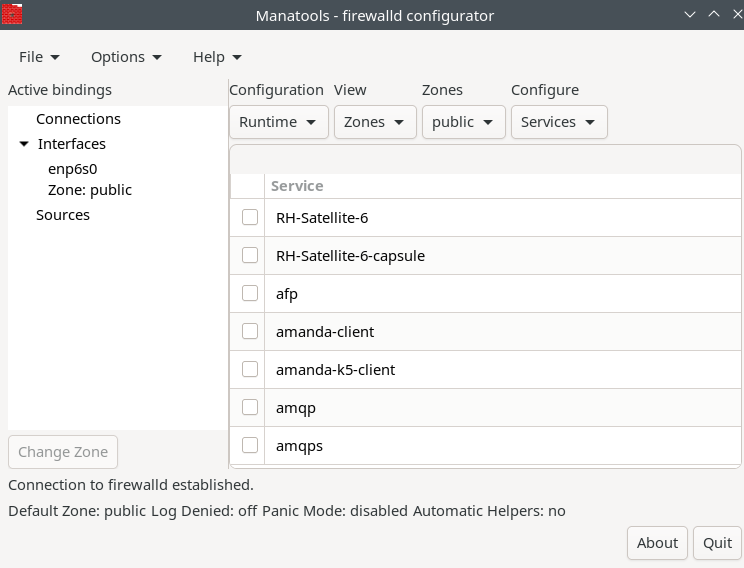
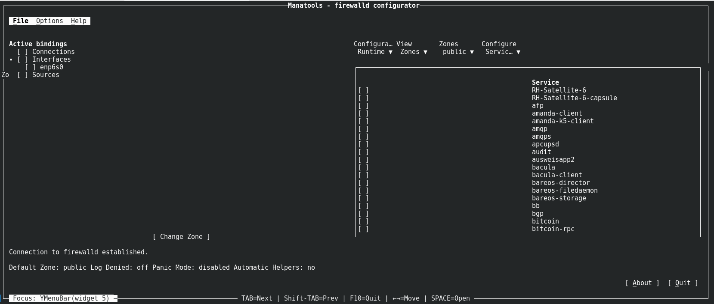

# mana firewall #

| | |
|-|-|
|| manafirewall is the graphical configuration tool for firewalld, based on [python-manatools](https://github.com/manatools/python-manatools) and its `manatools.aui` widget abstraction layer. It can be run using Qt (PySide6), GTK 4, or ncurses interfaces.|
| | |

Example with Qt:

Example with GtK:

Example with ncurses:

## REQUIREMENTS

### firewalld >= 1.3.0 with Python bindings (python3-firewall)
* https://github.com/firewalld/firewalld
* Provides the `firewall` Python package used for all firewall interaction.
* The `firewalld` daemon must be running (D-Bus service).

### python-manatools
* https://github.com/manatools/python-manatools
* Provides `manatools.aui` (the UI abstraction layer), `manatools.ui` (common dialogs
  and helpers), `manatools.services`, `manatools.config`, and `manatools.basehelpinfo`.

### At least one of the manatools.aui UI backends
* **Qt** — requires PySide6 (`python3-pyside6`)
* **GTK** — requires PyGObject with GTK 4 (`python3-gobject`, `gtk4`)
* **ncurses** — requires the standard `curses` module (included with Python)

### PyGObject / GLib (python3-gobject)
* https://pygobject.gnome.org
* Required by all backends: firewalld delivers its D-Bus signals via a `GLib.MainLoop`
  that runs in a background thread regardless of the chosen UI toolkit.

### dbus-python
* https://dbus.freedesktop.org/doc/dbus-python/
* Required for catching `DBusException` from the firewalld D-Bus interface.

### PyYAML
* https://pyyaml.org
* Required by `manatools.config` for reading the application configuration file
  (`manafirewall.yaml`).

## INSTALLATION

### Distribution packages:
* Mageia:
    * manafirewall: `dnf install manafirewall` or `urpmi manafirewall`
    * manafirewall-gui: `dnf install manafirewall-<gui>` or `urpmi manafirewall-<gui>`
        * Replace `<gui>` with `qt` or `gtk` depending on desired toolkit
* Fedora:
    * manafirewall:     `dnf install manafirewall`     (installs all needed for use on terminal)
    * manafirewall-gui: `dnf install manafirewall-gui` (installs all needed for use in desktop environment)

### From sources:
* Packages needed to build:
    * cmake >= 3.4.0
    * python3 >= 3.9
    * optional: gettext (for locales)
* Configure: `mkdir build && cd build && cmake ..`
    * `-DCMAKE_INSTALL_PREFIX=/usr`     — Sets the install path, e.g. /usr, /usr/local or /opt
    * `-DCHECK_RUNTIME_DEPENDENCIES=ON` — Checks if the needed runtime dependencies are met.
* Build:     `make`
* Install:   `make install`
* Run:       `manafirewall`

### From sources (for developers and testers only):
* Packages needed to build:
    * cmake >= 3.4.0
    * python3 >= 3.9
    * python3-virtualenv
    * optional: gettext (for locales)
* Setup your virtual environment
    * `cd $MANAFIREWALL_PROJ_DIR`                        — MANAFIREWALL_PROJ_DIR is the manafirewall project directory
    * `virtualenv --system-site-packages venv`           — create virtual environment under venv directory
    * `. venv/bin/activate`                              — activate virtual environment
    * `pip install python-manatools`                     — install python-manatools (or install from sources)
* Configure and install: `mkdir build && cd build && cmake -D... .. && make install`
    * Required cmake options:
        * `-DCMAKE_INSTALL_PREFIX=$MANAFIREWALL_PROJ_DIR/venv`              — venv install prefix
        * `-DCMAKE_INSTALL_FULL_SYSCONFDIR=$MANAFIREWALL_PROJ_DIR/venv/etc` — venv sysconfig directory
    * Useful cmake options:
        * `-DCHECK_RUNTIME_DEPENDENCIES=ON` — checks runtime dependencies
* Run `manafirewall` inside the virtual environment:
    * `--locales-dir`  — test localization locally
    * `--images-path`  — local icons and images (set to `$MANAFIREWALL_PROJ_DIR/venv/share/manafirewall/images/`)

## CONTRIBUTE

ManaTools and manafirewall developers (as well as some users and contributors) are on Matrix. The Matrix room is [`#manatools:matrix.org`](https://matrix.to/#/!manatools:matrix.org).

If you have any issues or ideas add or comment an [issue](https://github.com/manatools/manafirewall/issues).

Check also into our [TODO](TODO.md) file.

## LICENSE AND COPYRIGHT

See [license](LICENSE) file.
