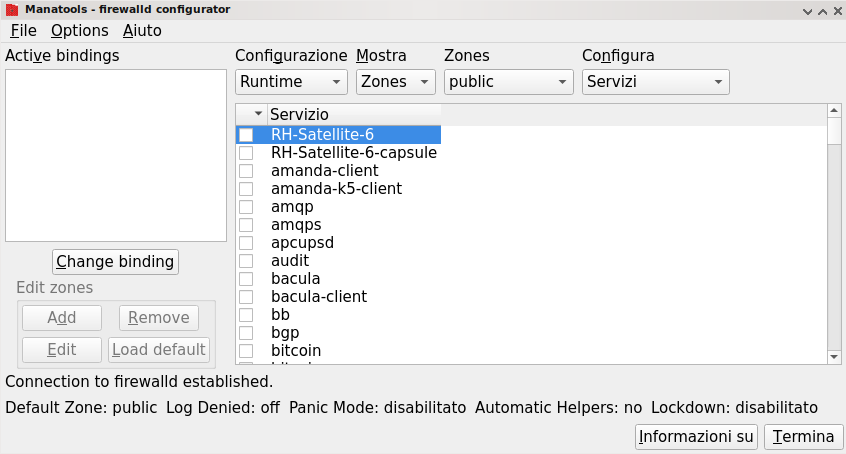
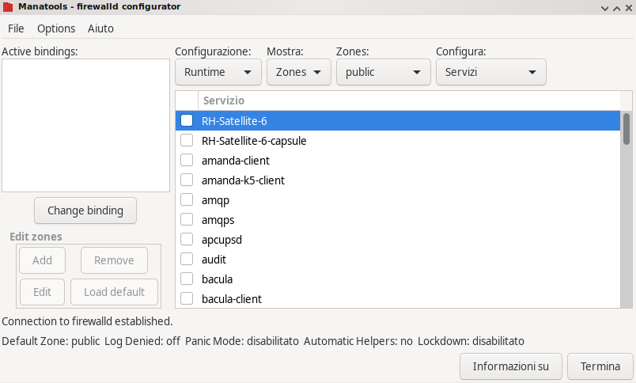
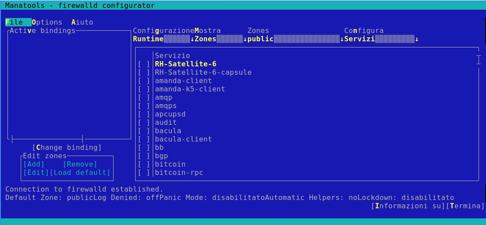

# mana firewall #

| | |
|-|-|
|| This is the graphical configuration tool for firewalld based on python manatools and libYui (Suse widget abstraction library), to be run using QT, Gtk or ncurses interface.|
| | |

Example with Qt:

Example with GtK:

Example with ncurses:

## REQUIREMENTS

### python3-firewall >= 0.9.0
* https://github.com/firewalld/firewalld

### SUSE libyui
* https://github.com/libyui/libyui
* Consider to check some not yet approved changes here https://github.com/anaselli/libyui

### libyui-mga > 1.1.0 - our widget extension
* https://github.com/manatools/libyui-mga

### SUSE libyui-bindings
* https://github.com/libyui/libyui-bindings
  At the moment add patch from anaselli branch to manage new libyui-mga 1.1.0 at
  https://github.com/libyui/libyui-bindings/pull/35

### at least one of the SUSE libyui plugins
* libyui-gtk     - https://github.com/libyui/libyui-gtk
* libyui-ncurses - https://github.com/libyui/libyui-ncurses
* libyui-qt      - https://github.com/libyui/libyui-qt
* Consider here also to check some not yet approved changes at
  https://github.com/anaselli/libyui-XXX forks (where XXX is
  gtk, qt or ncurses)

### at least one of the MGA libyui widget extension plugins (according to the one above)
* libyui-mga-gtk     - https://github.com/manatools/libyui-mga-gtk
* libyui-mga-ncurses - https://github.com/manatools/libyui-mga-ncurses
* libyui-mga-qt      - https://github.com/manatools/libyui-mga-qt

### python-manatools
* https://github.com/manatools/python-manatools

## INSTALLATION

### Distribution packages:
* Mageia:
    * manafirewall: `dnf install manafirewall` or `urpmi manafirewall`
    * manafirewall-gui: `dnf install manafirewall-<gui>` or `urpmi manafirewall-<gui>`
        * Replace `<gui>` with `qt` or `gtk` depending on desired toolkit
* Fedora:
    * manafirewall:     `dnf install manafirewall`     (installs all needed for use on terminal)
    * manafirewall-gui: `dnf install manafirewall-gui` (installs all needed for use in desktop environment)

### From sources:
* Packages needed to build:
    * cmake >= 3.4.0
    * python3-devel >= 3.4.0
    * optional: gettext        (for locales)
* Configure: `mkdir build && cd build && cmake ..`
    * -DCMAKE_INSTALL_PREFIX=/usr      - Sets the install path, eg. /usr, /usr/local or /opt
    * -DCHECK_RUNTIME_DEPENDENCIES=ON  - Checks if the needed runtime dependencies are met.
* Build:     `make`
* Install:   `make install`
* Run:       `manafirewall`

### From sources (for developers and testers only):
* Packages needed to build:
    * cmake >= 3.4.0
    * python3-devel >= 3.4.0
    * python3-virtualenv
    * optional: gettext        (for locales)
* Setup your virtual environment
    * cd $MANAFIREWALL_PROJ_DIR               # MANAFIREWALL_PROJ_DIR is the manafirewall project directory
    * virtualenv --system-site-packages venv  # create virtual environment under venv directory
    * . venv/bin/activate                     # activate virtual environment
* Configure: `mkdir build && cd build && cmake -D... .. && make install`
    * needed cmake options are
        * -DCMAKE_INSTALL_PREFIX=$MANAFIREWALL_PROJ_DIR/venv              - venv install prefix
        * -DCMAKE_INSTALL_FULL_SYSCONFDIR=$MANAFIREWALL_PROJ_DIR/venv/etc - venv sysconfig directory
    * useful cmake options are
        * -DCHECK_RUNTIME_DEPENDENCIES=ON  - Checks if the needed runtime dependencies are met.
* Run: `manafirewall` into virtual environment, add '--locales-dir' option if you want to test localization locally)
    * useful manafirewall options are
        * --locales-dir         - if you want to test localization locally
        * --images-path         - local icons and images (set to $MANAFIREWALL_PROJ_DIR/venv/share/manafirewall/images/)

## CONTRIBUTE

Manatools and manafirewall developers as well as some users or contributors are on IRC. They often discuss development issues there
and that to have imeediate feedbacks and ideas. The Freenode IRC channel is **#manatools**, get in touch with us.

If you have any issues or ideas add or comment an [issue](https://github.com/manatools/manafirewall/issues).

## LICENSE AND COPYRIGHT

See [license](LICENSE) file.
